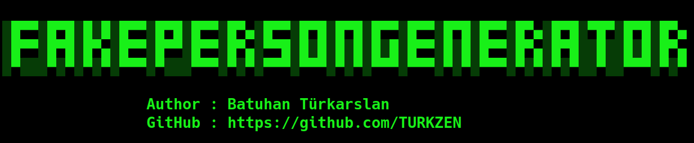

<h2 align="center"><u>Fake Person Generator Tool</u></h2>

 
    
    
    
    
    

### [+] Description
The reason for making the Fake Person Generator is to provide data security by providing fake information on website forms, as well as to facilitate the work of penetration testers.

### [+] Installation
 - `git clone https://github.com/TURKZEN/FakePersonGenerator.git`
 - `cd FakePersonGenerator`
 - `pip3 install -r requirements.txt`

### [+] Usage
`python3 fakepersongenerator.py`

### [+] Credits 
 TURKZEN

### [+] Find me on 

